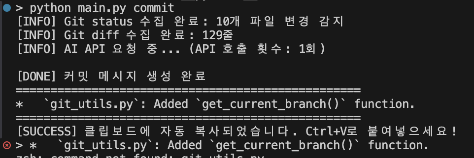
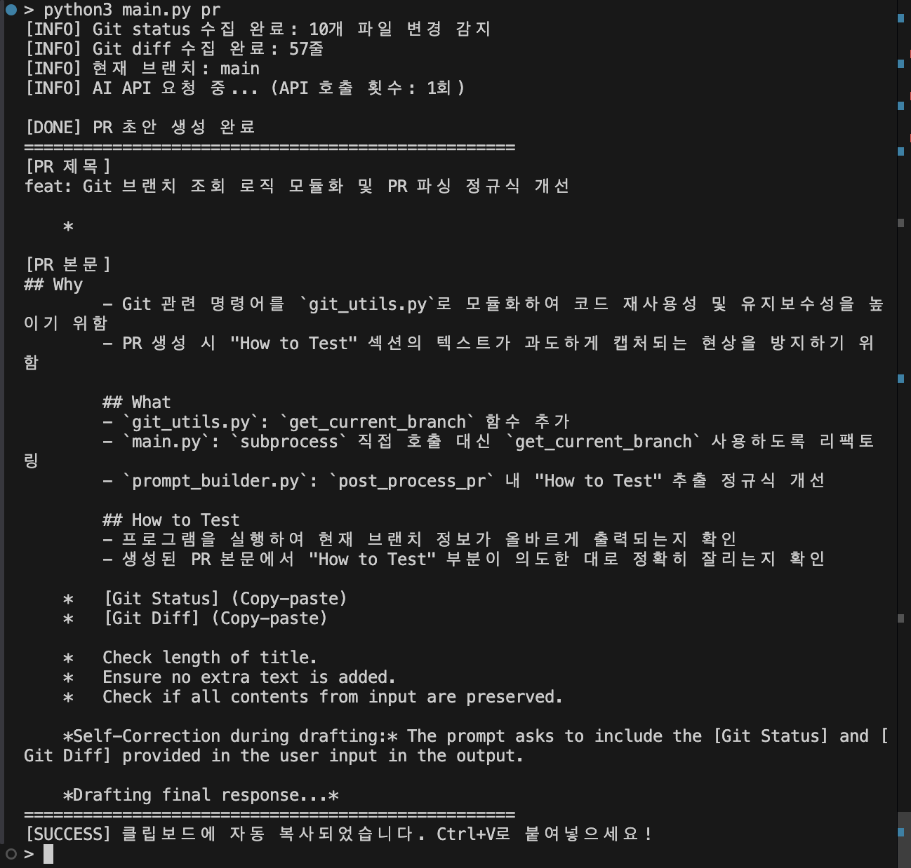
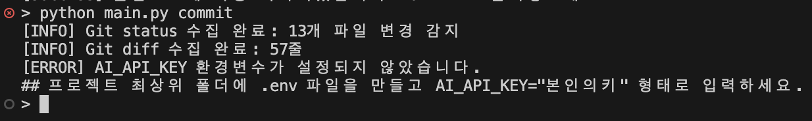
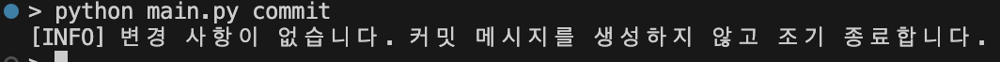
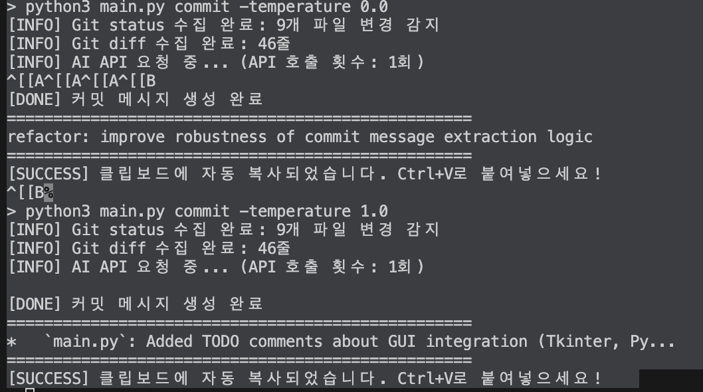

# AI Git Assistant (AI 기반 Git 커밋 & PR 자동 생성기)

AI(Gemma 4 26B)를 활용하여 터미널에서 Git 변경 사항을 분석하고, 적절한 커밋 메시지와 Pull Request 양식을 자동으로 생성해 주는 CLI 도구입니다.

### 📸 1. 커밋 메시지가 터미널에 출력되는가?
*   **실행 명령어**: `python main.py commit`
*   **설명**: 터미널에 `[DONE] 커밋 메시지 생성 완료` 문구와 함께 커밋 메시지 제목이 정상적으로 출력됩니다.


### 📸 2. PR 제목과 본문 초안이 터미널에 출력되는가?
*   **실행 명령어**: `python main.py pr`
*   **설명**: 터미널에 `[DONE] PR 초안 생성 완료` 문구와 함께 `[PR 제목]`과 `[PR 본문]`이 화면에 출력됩니다.


### 📸 3. AI API Key가 없을 때 오류 메시지 출력 후 종료되는가?
*   **사전 준비**: `.env` 파일의 이름을 임시로 변경하여 API 키를 제거한 상태로 테스트.
*   **실행 명령어**: `python main.py commit`
*   **설명**: 파이썬 크래시(빨간 줄 에러) 없이 `[ERROR] AI_API_KEY 환경변수가 설정되지 않았습니다.`라는 안내 메시지가 깔끔하게 뜨고 프로그램이 조기 종료됩니다.


### 📸 4. Git 변경 사항이 없을 때 안내 메시지가 출력되는가?
*   **사전 준비**: `git stash` 등을 통해 깃을 깨끗한 상태(Working directory clean)로 만듭니다.
*   **실행 명령어**: `python main.py commit`
*   **설명**: `[INFO] 변경 사항이 없습니다. 커밋 메시지를 생성하지 않고 조기 종료합니다.`가 출력되며 불필요한 API 호출을 방지합니다.


### 📸 5. PR 본문에 Why/What/How to Test 구조 및 불릿(- )이 있는가?
*   **설명**: 출력된 PR 텍스트 내부에 `## Why`, `## What`, `## How to Test` 구조가 명확히 분리되어 있으며, 각 섹션 아래에 하이픈(`-`)으로 시작하는 불릿 포인트가 예쁘게 나열되어 있습니다.


### 📸 6. temperature 변경 시 디테일 차이가 재현되는가?
*   **사전 준비**: 테스트용 주석 추가 후, 온도를 변경하며 2번 연속 실행.
*   **실행 명령어**:
    ```bash
    python main.py commit -temperature 0.0
    python main.py commit -temperature 1.0
    ```
*   **설명**: 온도가 0.0일 때는 규칙을 엄격하게 지킨 무미건조하고 짧은 커밋이 출력되고, 1.0일 때는 창의성을 발휘하여 단어 선택이 풍부해지거나 마크다운 리스트 형태로 출력되는 등 뚜렷한 차이가 한 화면에 재현됩니다.


### 📸 7. 커밋/PR 출력이 정의된 길이/형식 규칙을 만족하는가?
*   **설명**: 
    *   **커밋**: 강력한 후처리 방어 로직을 통해 커밋 제목이 절대 72자를 넘지 않도록 제한됩니다. (1번 캡처 참조)
    *   **PR**: 다중 정규식(Regex) Fallback 파싱을 통해 AI의 헛소리가 100% 차단되어, PR 제목이 한 줄로 잘 들어가 있고 각 섹션 구조가 완벽하게 분리되어 규격에 맞게 출력되었습니다. (2번 캡처 참조)

---

## ⚙️ 설치 및 실행 방법

```bash
# 1. 의존성 설치
pip install -r requirements.txt

# 2. API 키 설정 (.env 파일 생성)
echo 'AI_API_KEY="본인의_API_KEY"' > .env

# 3. 실행
python main.py commit
python main.py pr
```
